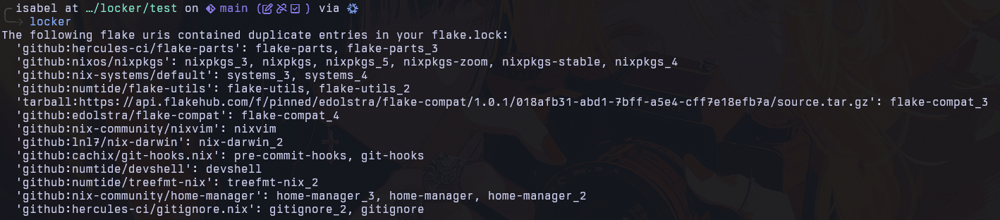

## Locker

Locker is a tool designed to lint your flake.lock file to find duplicate entries by their flake uri.



### Usage

```bash
locker <flake-lock-file>
```

### GitHub Action

```yaml
name: Validate Flake Lock

on:
  workflow_dispatch:
  push:
    paths:
      - "**.lock"

jobs:
  check-flake:
    name: Check Lock
    runs-on: ubuntu-latest

    steps:
      - name: Checkout
        uses: actions/checkout@v4

      - name: Install Nix
        uses: cachix/install-nix-action@v31

      - name: Check flake.lock
        run: nix run github:tgirlcloud/locker
```
